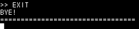

# filesystem
> **Fat16 파일시스템 구현**
>
> **장비** : SD card, S3C2440 하드웨어 보드, LCD 스크린 모듈
>
> **언어** : C언어

### 개요

- 콘솔창에 주어진 명령어 입력을 통해 보드에 삽입된 SD카드의 파일을 읽어오는 등 파일 시스템 동작을 수행함

- 구현 내용 [코드 보기](fat16파일시스템_Main.c)
  - listing Root/Sub directory files
  - reading file 
  - renaming file
  - copying file
  - deleting file

### 프로그램 동작 설명

- 초기화면

  

- listing directory files (CD `디렉터리명`) 

  

- reading file (OPEN `파일명`)

  

- remaing file (RENAME `old_파일명 new_파일명`)

  

- copying file

  

- exit program

  

### 핵심 알고리즘

| 기능                   | 내용                                                         |
| ---------------------- | ------------------------------------------------------------ |
| Sub디렉터리 접근       | 해당 디렉터리 entry에서 첫 cluster위치를 찾아와 파일이름의 첫 바이트가 0x0일때까지 목록을 listing시켜줌 |
| reading file           | 해당 파일 entry에서 첫 cluster위치를 찾아와 마지막 cluster(0xFFFF)까지 파일을 읽어냄 |
| Renaming, copying file | 해당 파일의 entry를 찾아 sector단위로 read&write 동작을 수행하여 원하는 정보를 복사하고 수정함 |

